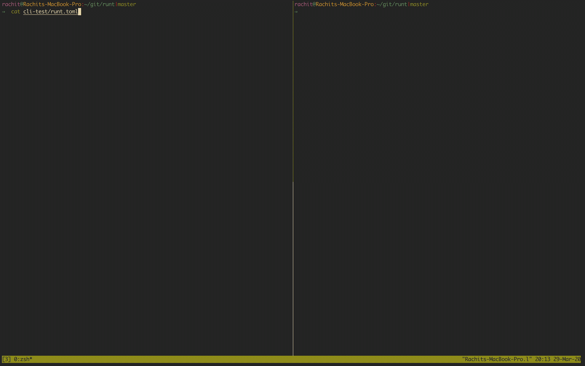

# RUN Test (RUNT) &emsp; [![latest]][crate]

[latest]: https://img.shields.io/crates/v/runt.svg
[crate]: https://crates.io/crates/runt

Runt is a lightweight, parallel snapshot testing framework. It aims to enable
snapshot testing with minimal configuration.



Install the latest version of `runt` using:
```
cargo install runt
```

Runt is most useful when you have the following test setup:
- One command that needs to run on many input files.
- Test suites grouped by commands run on the files.
- Test outputs are sent to IO streams (stdout and stderr).

Runt is not useful when you want to do:
- Rich introspective testing of data structures.
- Test suites with complex setups, dependencies, and teardowns.

Snapshot testing with runt is extremely flexible. For example, the tests
under `runt-cli-test` test the outputs of the runt CLI.

#### Workflow

**Showing diffs**: By default, runt does not show diffs between the new output
and the expect file. Use `--diff` to show the diffs.

**Saving changes**: The `--save` flag overwrites the expect files to save the
updated outputs.

**Suppress specific outputs**: The `--only` flag can be used to focus on only
failing, missing, or correct tests. It composes with the diff and save flags.

### Building & Developing

- Install [Rust][].
- Run `cargo build --release`. The `runt` executable is generated
  under `target/release/runt`.
- Runt is tested using `runt`. Run `runt runt-cli-test` to test runt.

### Example

- Runt has a minimal configuration example under cli-tools. The `runt.toml`
  file contains all the configuration and explanation for various options.

[rust]: https://www.rust-lang.org/tools/install
